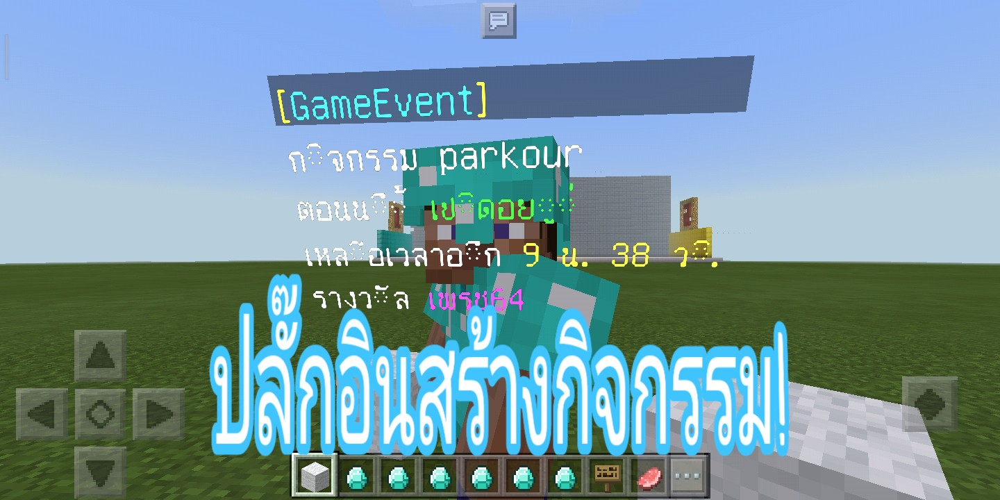

```diff
- ปลั๊กอินนี้จะไม่ทำงาน ถ้าคุณไม่ได้ลงปลั๊กอิน Slapper
```


**คุณสมบัติของปลั๊กอิน**<br>
- ปลั๊กอินนี้สามารถสร้างกิจกรรมได้หลายรูปแบบ ขึ้นอยู่กับคำสั่งสตาร์ทตอนที่สร้างกิจกรรม ว่าคุณจะใส่คำสั่งอะไรลงไป ตัวอย่างเช่น กิจกรรมแลกของ คุณก็ใส่คำสั่งแลกของลงไปในคำสั่งสตาร์ทตอนสร้างกิจกรรม และคำสั่งแลกของคุณก็ต้องใส่คำสั่ง gameevent award <ชื่อผู้เล่น> <ชื่อกิจกรรม> เพื่อเป็นการทำให้ผู้เล่นทำกิจกรรมสำเร็จ

- runtime() จะรันเวลากิจกรรมถอยหลังจนจบ และกิจกรรมจะทำการ reset ผู้เล่นที่เคยทำกิจกรรมนี้ทั้งหมด และตั้งเวลาใหม่
- PresentEvent() คือกิจกรรมปัจุบันที่รันเวลาอยู่
- NextEvent() คือกิจกรรมต่อไปจากกิจกรรมปัจุบันที่รันเวลาจนจบ
- EnabledEvent() เปิด/ปิดกิจกรรม
- PlayerStartEvent() ผู้เล่นเริ่มทำกิจกรรม
- PlayerAwardEvent() ผู้เล่นรับรางวัลกิจกรรม


**วิธีใช้งาน**<br>
- คลิปตัวอย่างสร้างกิจกรรม Parkour [คลิก](https://youtu.be/-XBYw0t43As)


## ดาวโหลด
| version  | plugin support                        | Download  zip/phar                                                 |
| ---- | ------------------------------------ | ---------------------------------------------------------- |
| 1.0  | GenisysPro api 3.0.1 mcpe 1.1 [Click here](https://github.com/GenisysPro/GenisysPro) | [คลิก](https://github.com/HmmHmmmm/GameEventPlugin/releases/1.0) |


**API**<br>
- GameEvent::getInstance()::onPlayerAwardEvent(Player $player, string $eventName) #ให้ผู้เล่นทำกิจกรรมสำเร็จ


**Command**<br>
#default: op
- /gameevent info : เครดิตผู้สร้างปลั๊กอิน
- /gameevent create <ชื่อกิจกรรม> <เวลา> <ข้อความอธิบาย> <ข้อความรางวัล> : สร้างกิจกรรม
- /gameevent list : ดูรายชื่อกิจกรรม
- /gameevent remove <ชื่อกิจกรรม> : ลบกิจกรรม
- /gameevent settime <ชื่อกิจกรรม> <เวลา> : เช็ตเวลากิจกรรม
- /gameevent setpresent <ชื่อกิจกรรม> : เช็ตเป็นกิจกรรมปัจจุบัน
- /gameevent setnext <ชื่อกิจกรรม> : เช็ตเป็นกิจกรรมถัดไป
- /gameevent enabled <ชื่อกิจกรรม> on|off : เปิด/ปิดกิจกรรม
- /gameevent start <ชื่อผู้เล่น> <ชื่อกิจกรรม> : ให้ผู้เล่นเริ่มทำกิจกรรม
- /gameevent award <ชื่อผู้เล่น> <ชื่อกิจกรรม> : เพิ่มผู้เล่นรับรางวัลกิจกรรม
- /gameevent sign_start : สร้างป้ายเริ่มกิจกรรม
- /gameevent slapper_start : สร้างหุ่นเริ่มกิจกรรม
- /gameevent slapper_award <ชื่อกิจกรรม> : สร้างหุ่นกิจกรรมรับรางวัล
